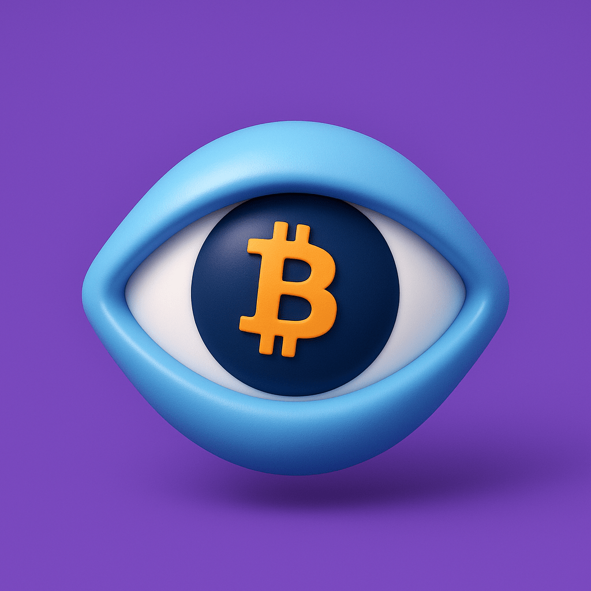
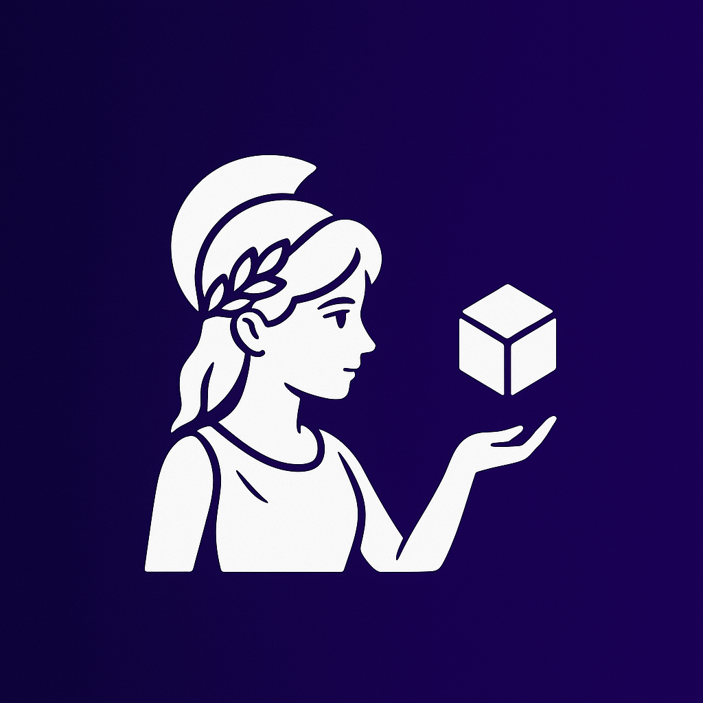
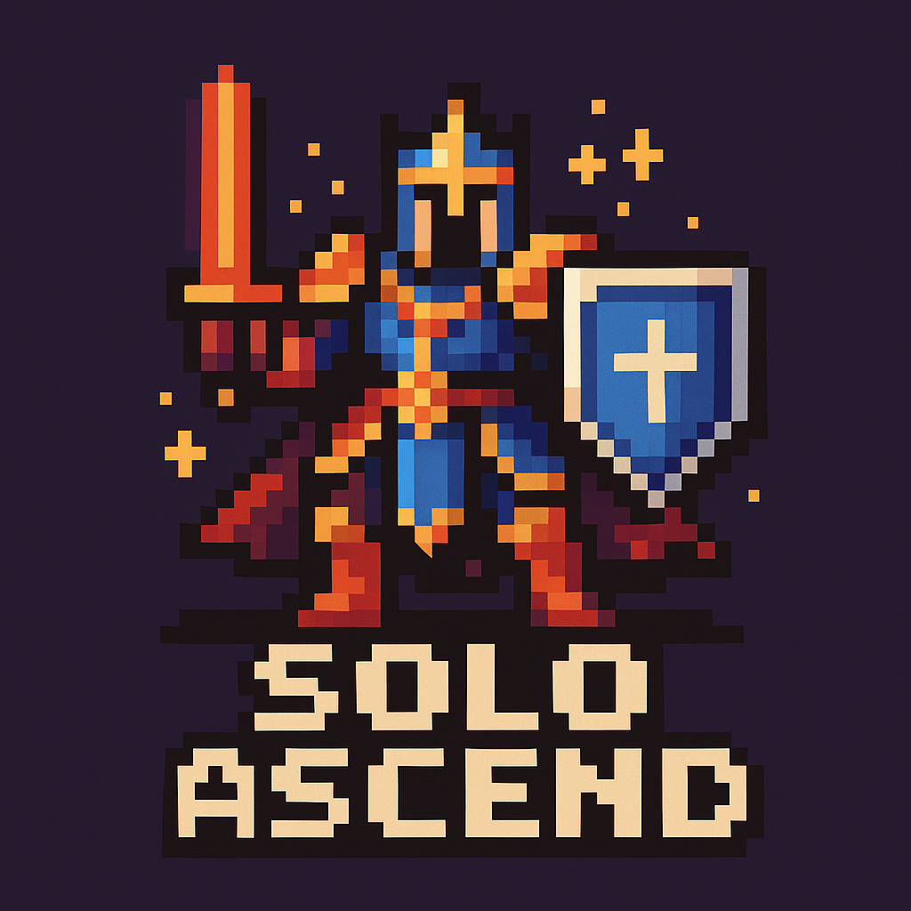

# 🚀 Welcome to My AI & Web3 Universe

  
  
  
  

  

## 🎮 LOLPro - Born for Competition, Master Every Match

LOLPro is a lightweight desktop assistant designed specifically for League of Legends competitive players. By deeply integrating LCU (League Client Update) and LiveClient API, we provide real-time, precise, and fully automated build guidance and status tracking for "ARAM - Hextech" and "Arena" modes. Say goodbye to the hassle of checking webpages—click and reach the peak.

### Key Features
- **Deep Mode Adaptation**: Exclusive recommendations like Hextech Augments and skill scheduling beyond just win rates.
- **Millisecond-Level Sync**: Real-time monitoring from champ select to in-game, never missing a critical update.
- **In-Depth Build Analysis**: Instant expert-level builds, runes, and skill priorities backed by match data.
- **Real-Time Pinned Overlay**: Transparent in-game overlay to view combinations and runes without interference.

  
  
  

  

  

  

  

## 📺 Party Stream - Multi-Platform Live Stream Co-Viewing

Party Stream allows you to watch multiple live streams from different platforms simultaneously without being restricted by browser tabs.

### Key Features
- **All Streams in One Screen**: Aggregate streams from Bilibili, Douyu, Huya, and Douyin.
- **Ultimate Control**: Freely drag, seamlessly zoom, and independently mute PiP windows.
- **WebRTC High-Speed Core**: Ultra-low latency (<100ms) private stream transmission up to 4K quality.
- **Smart Scene Ecology**: Export your multi-window layouts or import popular setups with one click.

  
  
  

  

  

  

  

## 🔭 NebulaEye - Multi-Factor Crypto Intelligence

### Key Features
- **Continuous Scoring Engine**: Non-linear factor mapping keeps scores granular from -100 to +100.
- **Hybrid Quant + AI**: Combines LLM insights with quantitative signals for conflict-aware decisions.
- **Dual Position Modes**: Supports spot and futures simulation with configurable risk controls.
- **Macro-Aware**: Adjusts convictions using SPX/DXY-driven multipliers.
- **Alerts & Dashboard**: Rich Lark/Telegram notifications plus a Streamlit dashboard for control.

  
  
  

  

  

  

  

## 🤝 Hermis - Web3 Crowdsourcing Coordination Layer

### Key Features
- **Mission Orchestration**: Coordinate on-chain missions end-to-end, from submissions to arbitration.
- **Composable Guards**: Mix-and-match submission, review, and escalation rules with reusable presets.
- **Reputation-First Identity**: Soulbound reputation tiers and staking requirements surface trusted contributors.
- **Real-Time Intelligence**: Dashboards stream live data from the Hermis subgraph for instant insight.
- **Wallet-Native UX**: RainbowKit, Wagmi, and Viem keep Base Sepolia interactions seamless.

  
  
  

  

  

  

  

## ⚔️ Solo Ascend - A Web3 Gaming Revolution

### Key Features
- **True Ownership**: All in-game assets are NFTs on the blockchain
- **Daily Forge**: Just like **Duel Arena**
- **Dynamic NFTs**: Characters evolve based on your achievements
- **Decentralized**: Fully on-chain game logic ensures transparency

  
  
  

  

  

  

## 🫶 Support the Mission

  <strong>ETH:</strong> <code>0x9Ce4f6A14028a3C40F0ec592551dC724d80fEf79</code>

## 💡 Philosophy

  
  *"Bridging intelligence and decentralization to build the next generation of applications."*
  
  **🧠 AI empowers boundless possibilities, while 🔗 Blockchain guarantees immutable trust and ownership.**
  

---

  
  ### 🏗️ Building in Public | 🤝 Open for Collaboration | 🌍 AI & Web3 Innovator
  
  
  

